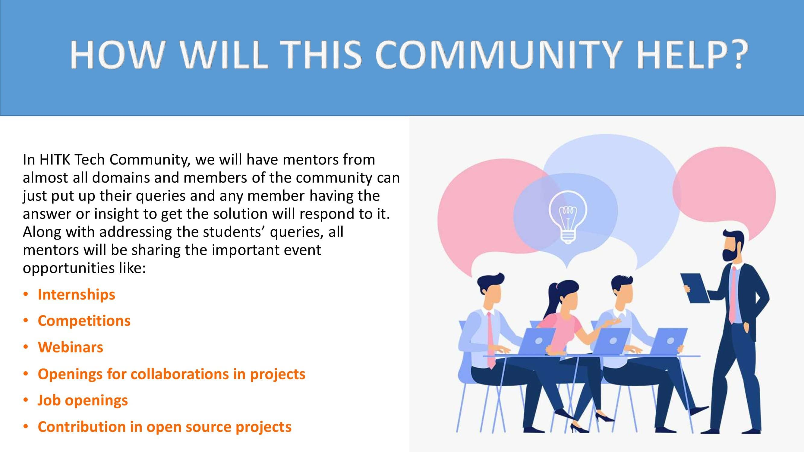
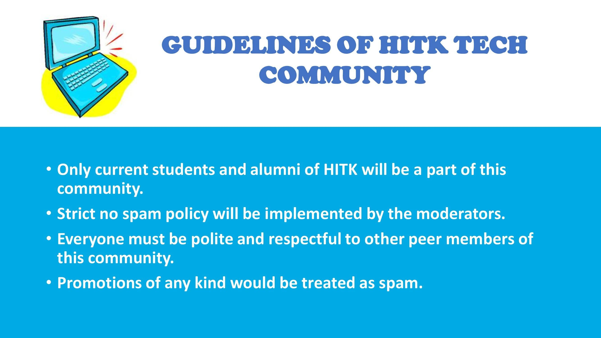

  <b> HITK Tech Community 👩🏻‍💻👨🏻‍💻 </b>
  

Being from tier-2 and tier-3 colleges, you often face the problem of knowledge gap in our college days. But once you begin walking in the path of tech, you discover a place where people are just like you. 😇✨ 
We are a group of HITK students trying to fill the knowledge gap and help you find your place of discovery by sharing you the opportunities and resources at the right time!⏱️ 

**HITK Tech Community** is a platform that helps the campus students of Heritage Institute of Technology in providing opportunities related to tech, such as:

**⭕ Webinars**  
**⭕ Internships**  
**⭕ Competitions**  
**⭕ Job openings**  
**⭕ Openings for collaborations in projects**  
**⭕ Contribution in open source projects**

This will not only give practical work experience/exposure to students, but will also help the students to know and grab their required opportunities in time! And all this will be done ensuring the guidelines issued by us during community creation. This community is going to help you accelerate your learning, and bring you closer to like-minded individuals, who could all be a valuable asset in your journey, and you should be sure to utilise this to your advantage.👩🏻‍💻👨🏻‍💻

You must be curious to know more about us.😀 So, go ahead with your curiosity, read the details in the posters given below and spread the word amongst your fellow HITK students.

<kbd></kbd>
<kbd></kbd>    
<kbd></kbd> 
<kbd></kbd>

**Congrats!!🎉 You have read this far, it means you know our motive very well and we would love to see your support 🙌**    
    **1. Star (🌟) this repo.**  
    **2. Share the resource that you think can help any students by filling this form 📃**  
    **https://docs.google.com/forms/d/e/1FAIpQLSfQrkHNKmj5woQSv6jnorvnPCkYqNuviuYeIoiwHW5-B8mQOA/viewform?usp=sf_link**  
    **We would then very it's validity and authentication and will share it to the other group members.👩🏻‍💻👨🏻‍💻**  
    **3. Create a PR to improve the contents of this repo.**

<b>This repository contains all the broadcasts done in the HITK Tech community group, so even if you are not from HITK, you can still visit here to checkout the resources anytime!</b>😊
